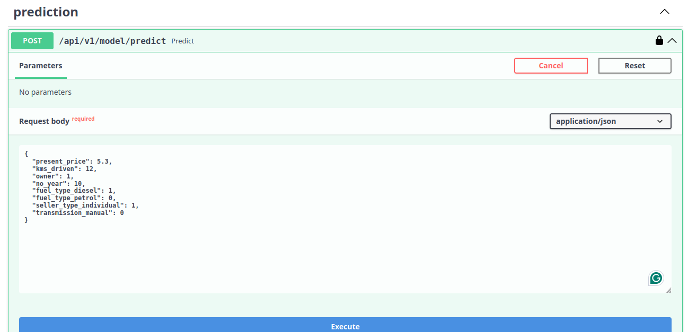

# Car Price Prediction
This is end to end machine learning project that deals the problem of predicting the price of car based on the input features of car and other parameters. The sk-learn model is deployed using the fastapi library.

## Installation
Install the required packages in your local environment (ideally virtualenv, conda, etc.).

```bash
poetry install
``` 


## Setup
1. Duplicate the `.env.example` file and rename it to `.env` 


2. In the `.env` file configure the `API_KEY` entry. The key is used for authenticating our API. <
   A sample API key can be generated using Python REPL:

```python
import uuid
print(str(uuid.uuid4()))
```

## Run It

1. Start your  app with:

```bash
set -a
source .env
set +a
uvicorn car_price_prediction_fastapi.main:app
```

2. Go to [http://localhost:8000/docs](http://localhost:8000/docs).
3. Click `Authorize` and enter the API key as created in the Setup step.
 

4. You can use the sample payload from the `docs/sample_payload.json` file when trying out the house price prediction model using the API.
   

## Linting

This skeleton code uses isort, mypy, flake, black, bandit for linting, formatting and static analysis.

Run linting with:

```bash
./scripts/linting.sh
```

## Run Tests

Run your tests with:

```bash
./scripts/test.sh
```

This runs tests and coverage for Python 3.11 and Flake8, Autopep8, Bandit.

Happy Coding


